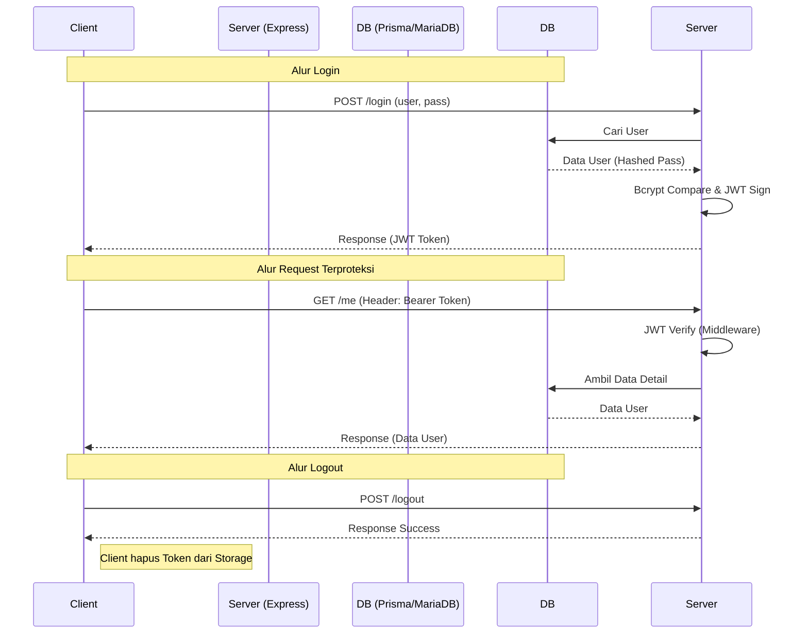

# Penjelasan Alur Autentikasi (JWT + Prisma)

Dokumen ini menjelaskan bagaimana sistem keamanan (Auth) di project ini bekerja, mulai dari Login hingga Logout.

## 1. Arsitektur Stateless
Sistem ini menggunakan **JSON Web Token (JWT)** yang bersifat *stateless*. Artinya, server tidak menyimpan data "siapa yang sedang login" di dalam memori atau database (session). Semua informasi identitas disimpan di dalam token itu sendiri yang dibawa oleh Client (Frontend).

## 2. Alur Algoritma

### A. Alur Login (Signing)
1. **Input**: User mengirim `username` dan `password`.
2. **Verification**: 
   - Server mencari user di database via Prisma.
   - Server mengecek apakah password cocok menggunakan `bcrypt.compare()`.
3. **Signing**: 
   - Jika cocok, server membuat "Surat Izin" (Token) menggunakan `jwt.sign()`.
   - Token ini berisi data user (id, role) dan dienkripsi menggunakan `JWT_SECRET`.
4. **Response**: Token dikirim balik ke Client.

### B. Penyimpanan Token (Client-side)
- Client menerima token dan menyimpannya (biasanya di `localStorage` atau `Cookie`).
- Server **tidak tahu** dimana token disimpan, server hanya akan mengeceknya jika token dikirim kembali.

### C. Alur Request Terproteksi (Middleware Verification)
Setiap kali Client ingin mengakses data rahasia (misal: `/api/auth/me`), Client harus mengirim token di header: `Authorization: Bearer <TOKEN>`.

1. **Middleware**: Fungsi `authenticateJWT` di `authMiddleware.ts` mencegat request.
2. **Verification**: Server mengecek keaslian token menggunakan `jwt.verify()` + `JWT_SECRET`.
3. **Context**: Jika asli, data user di dalam token dimasukkan ke `req.user` agar bisa dipakai oleh Controller.
4. **Next**: Request lanjut ke Controller tujuan.

### D. Alur Logout (Invalidation)
Karena server *stateless*, server tidak bisa "menghapus" token yang sudah ada di tangan Client.
1. **Request**: Client mengirim request ke `/api/auth/logout`.
2. **Action**: Server hanya mengirim respon sukses.
3. **Client Responsibility**: Client **wajib** menghapus token dari penyimpanannya (`localStorage.removeItem('token')`). Setelah dihapus, Client tidak bisa lagi mengirim header Authorization yang valid.

## 3. Visualisasi Alur (Mermaid Diagram)

## 4. Keuntungan Arsitektur Ini
- **Scalable**: Server tidak terbebani memori untuk menyimpan session.
- **Microservices Ready**: Token bisa diverifikasi oleh server manapun selama punya `JWT_SECRET` yang sama.
- **Fast**: Tidak perlu query ke DB hanya untuk cek "apakah user ini login" (cukup verifikasi token secara matematis).

## 5. Keamanan & Durasi Token (Best Practice)
Secara industri, durasi token ditentukan berdasarkan tingkat sensitivitas data:

| Jenis Token | Durasi Umum | Penyimpanan | Tujuan |
| :--- | :--- | :--- | :--- |
| **Access Token** | 15 - 60 Menit | Memory / JS State | Digunakan untuk setiap request API. |
| **Refresh Token** | 7 - 30 Hari | HttpOnly Cookie | Digunakan untuk meminta Access Token baru. |

### Kenapa kita pakai 30 Menit?
Dalam implementation saat ini, kita menggunakan **30 menit** sebagai Access Token. Ini adalah titik seimbang antara:
- **Keamanan**: Jika token dicuri, ia akan mati secara otomatis dalam waktu singkat.
- **Kenyamanan**: User tidak perlu login ulang terlalu sering selama sesi aktif (30 menit).

### Pengembangan Masa Depan: Refresh Token
Jika aplikasi kamu semakin besar, disarankan menggunakan sistem **Dual Token**:
1. User login -> Dapat **Access Token** (30m) & **Refresh Token** (7 hari).
2. Access Token mati (setelah 30m) -> Frontend mengirim Refresh Token ke API khusus untuk dapat Access Token baru.
3. User tidak perlu login ulang (masukkan password) selama Refresh Token masih valid.
